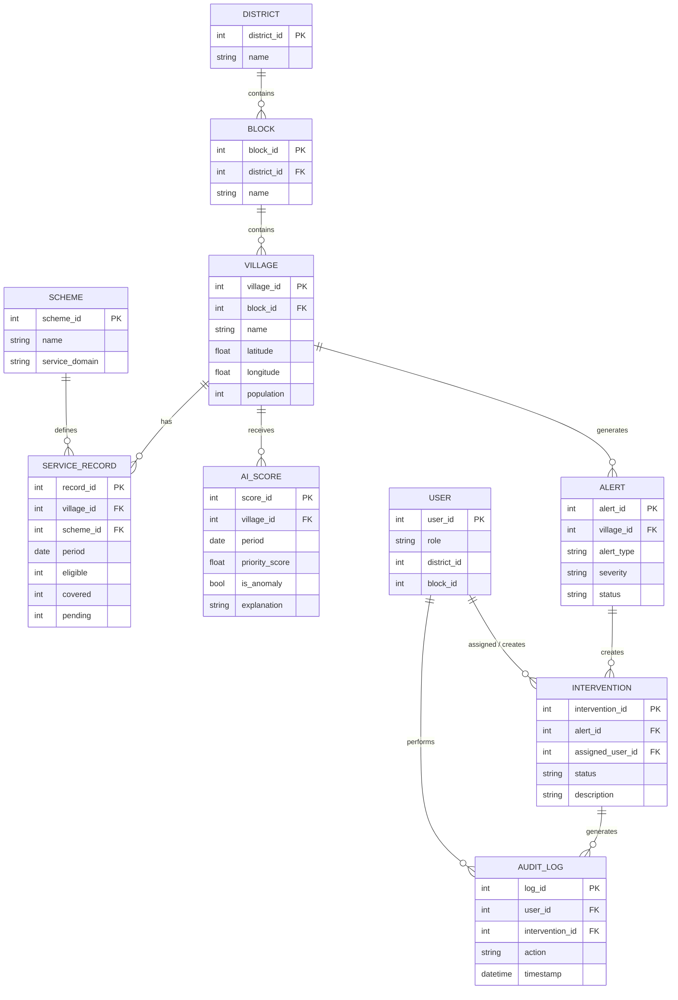
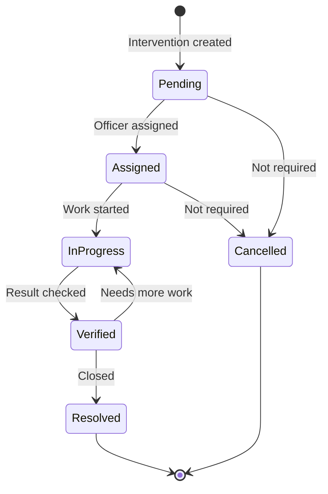
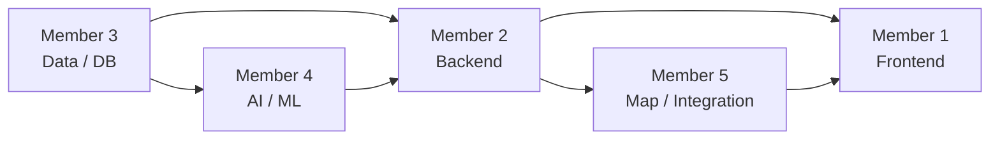
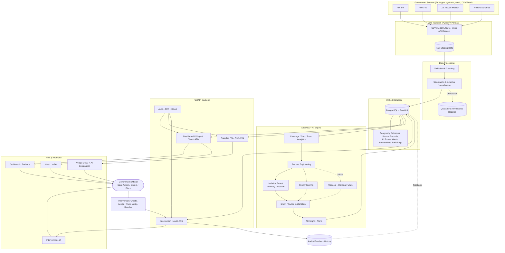
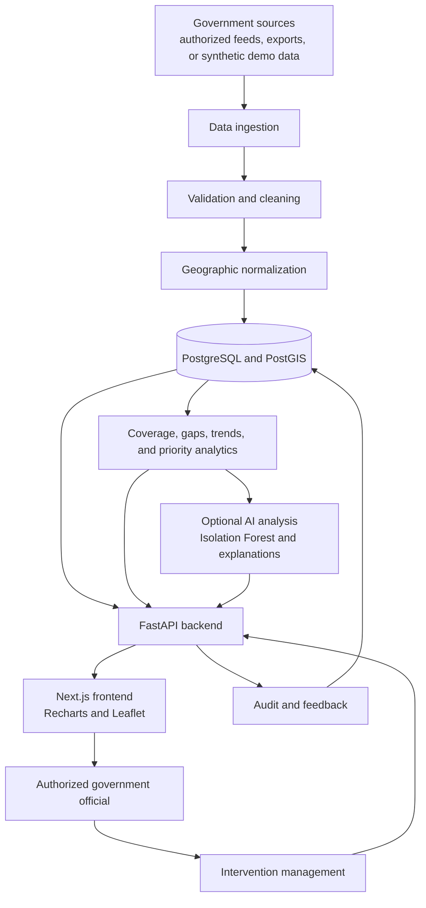
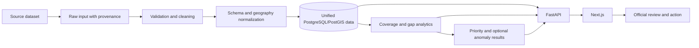
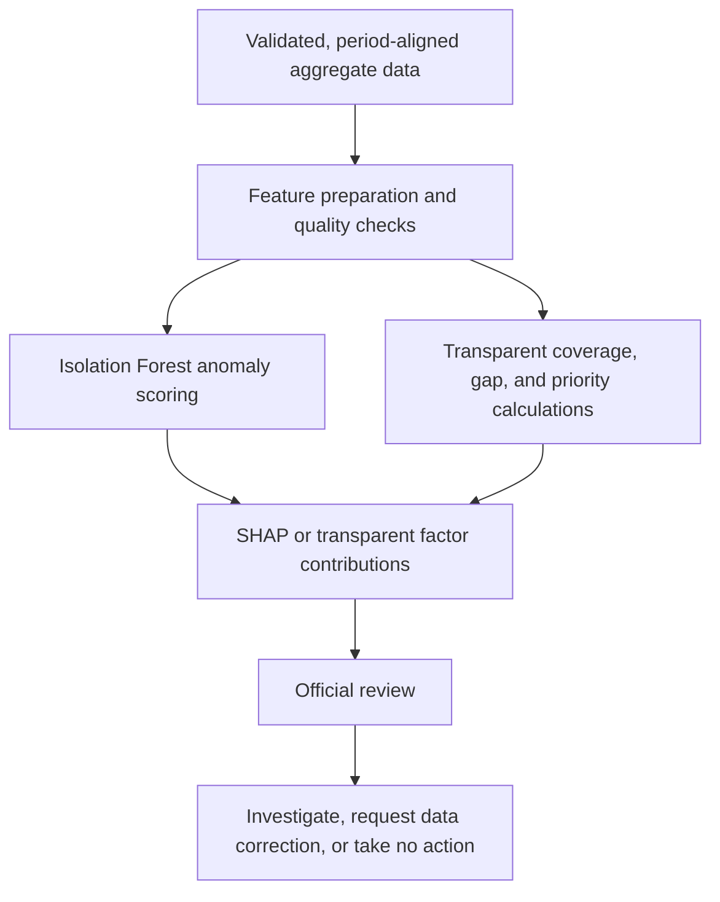
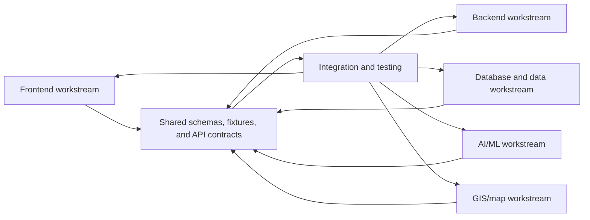

# SevaAI Manipur: Technical Architecture & Functional Blueprint

**AI-Powered Welfare & Public Service Gap Intelligence Platform**

> **Status:** Architecture blueprint (no application code in this document)
> **Audience:** Hackathon team, new contributors, and (later) judges
> **Golden rule:** Simple → Modular → Explainable → Demonstrable → Scalable

---

## Table of Contents

1. [Plain-Language Overview](#1-plain-language-overview)
2. [System Architecture (Layered)](#2-system-architecture-layered)
3. [Government Data Source Layer](#3-government-data-source-layer)
4. [Data Ingestion Layer](#4-data-ingestion-layer)
5. [Data Validation & Cleaning](#5-data-validation--cleaning)
6. [Geographic Normalization](#6-geographic-normalization)
7. [Unified Data Layer](#7-unified-data-layer)
8. [Analytics Engine (Non-ML)](#8-analytics-engine-non-ml)
9. [AI / Machine Learning Layer](#9-ai--machine-learning-layer)
10. [Optional Priority Prediction Model (XGBoost)](#10-optional-priority-prediction-model-xgboost)
11. [Explainable AI (SHAP)](#11-explainable-ai-shap)
12. [AI Decision Pipeline](#12-ai-decision-pipeline)
13. [Backend Architecture (FastAPI)](#13-backend-architecture-fastapi)
14. [Frontend Architecture (Next.js)](#14-frontend-architecture-nextjs)
15. [Map / GIS Architecture](#15-map--gis-architecture)
16. [Intervention Workflow](#16-intervention-workflow)
17. [Authentication & Role-Based Access](#17-authentication--role-based-access)
18. [Security & Privacy](#18-security--privacy)
19. [Complete Technology Stack](#19-complete-technology-stack)
20. [Complete Data Flow (One Village's Journey)](#20-complete-data-flow-one-villages-journey)
21. [Complete User Workflow](#21-complete-user-workflow)
22. [Failure & Edge Cases](#22-failure--edge-cases)
23. [Prototype vs Production](#23-prototype-vs-production)
24. [MVP Scope](#24-mvp-scope)
25. [Team Module Division](#25-team-module-division)
26. [Final Architecture Diagram](#26-final-architecture-diagram)
27. [Final Summary](#27-final-summary)

---

## 1. Plain-Language Overview

### What problem are we solving?

Government welfare and public-service data lives in **separate systems**. Housing data is in one place, water-supply data in another, health-insurance data in a third, and social-security data in a fourth. Each system has its own format, its own naming for places, and its own reports.

An official who wants to know *"Which villages are being left behind across several services at once?"* has to open several systems, export several files, and compare them by hand. In practice that means:

- Problems that span **multiple services** are easy to miss, because each system only shows its own slice.
- Village names are spelled differently in different systems, so data cannot be matched easily.
- Unusual patterns (a sudden jump in pending cases, a village that is far below its neighbours) are noticed late, if at all.
- Even when a problem is found, there is no connected path from "we found it" to "someone is assigned and we can track it."

### What does SevaAI Manipur actually do?

SevaAI Manipur is a **decision-support platform**. It:

1. **Collects** data from multiple welfare/public-service schemes.
2. **Cleans and aligns** it so every record points to the same village.
3. **Combines** it into one unified picture per village.
4. **Analyses** it: coverage, gaps, pending cases, trends.
5. **Uses AI** to flag unusual patterns and produce a transparent priority score.
6. **Explains** *why* a village is flagged.
7. **Lets officials act**: create an intervention, assign an officer, track it to resolution.
8. **Records everything** in an audit history.

### Who uses it?

| User | What they do |
|---|---|
| **State Admin** | Sees the whole of Manipur; spots statewide patterns; oversees districts |
| **District Officer** | Sees only their district; reviews flagged villages; creates and assigns interventions |
| **Block Officer** | Sees only their block; works on assigned interventions; updates status |

### What happens when an official logs in?

1. They sign in with their credentials.
2. The system identifies their **role and jurisdiction** (state / district / block).
3. They land on a **dashboard** showing only the data they are allowed to see: key numbers, coverage trends, high-priority areas, AI alerts, and pending interventions.
4. From there they can open the **map**, drill into a **village**, read the **AI explanation**, and **create an intervention**.

### What makes it different from a normal government dashboard?

| Normal dashboard | SevaAI Manipur |
|---|---|
| Shows one scheme at a time | Combines **many schemes** per village |
| Shows numbers | Shows numbers **plus a priority score** |
| "This is low" | "This is low **and here is why it matters**" |
| Cannot flag unusual patterns | Uses **anomaly detection** to flag patterns worth investigating |
| Ends at the chart | Continues to **action**: intervention → assignment → tracking → verification |
| No memory of what was done | Full **audit history** |

### A simple real-world example

> *All numbers in this example are synthetic and for illustration only.*

Imagine a village called **"Village X"** (a made-up village). The system holds these figures:

| Indicator | Value |
|---|---|
| Water coverage | Very low |
| Welfare coverage | Very low |
| Health-service coverage | Low |
| Housing coverage | Moderately low |
| Pending cases | High |
| Historical trend | Getting worse over the last few periods |

**Without SevaAI**, an official would have to open four or five systems, find "Village X" under four different spellings, copy numbers into a spreadsheet, and compare it with other villages by hand.

**With SevaAI**:

1. The system has already merged all of this under **one village record**.
2. It calculates a **Priority Score (for example 87/100)**.
3. The anomaly detector notes that this *combination* of low coverage is unusual compared with similar villages.
4. The village appears on the dashboard and the map in **red**.
5. The official opens the village and sees **why** it is high priority: *low water coverage, low welfare coverage, high pending cases, negative trend*.
6. The official clicks **Create Intervention**, assigns a responsible officer, and tracks progress.
7. Every step is logged.

We use **Village X** again later (Sections 8, 11, 20) to show how this same record travels through the entire system.

> **Important principle:** SevaAI does **not** approve or reject any benefit. AI supports the decision. The **final administrative decision always stays with an authorized official**.

---

## 2. System Architecture (Layered)

### The full conceptual flow

```
Government Data Sources
        ↓
Data Ingestion Layer
        ↓
Data Validation & Cleaning
        ↓
Geographic & Schema Normalization
        ↓
Unified Data Layer  (PostgreSQL + PostGIS)
        ↓
Analytics & AI Engine
        ↓
FastAPI Backend
        ↓
Next.js Frontend
        ↓
Government Official
        ↓
Intervention / Action
        ↓
Verification & Audit History
        ↓
Feedback / Historical Data  ──► (loops back into the Unified Data Layer)
```

### Layer-by-layer summary

| # | Layer | Purpose | Detailed in |
|---|---|---|---|
| 1 | Government Data Sources | Where data originates | §3 |
| 2 | Data Ingestion | Bring data in, in any format | §4 |
| 3 | Validation & Cleaning | Make data trustworthy | §5 |
| 4 | Geographic & Schema Normalization | Make every record point to the same village | §6 |
| 5 | Unified Data Layer | One central, structured store | §7 |
| 6 | Analytics & AI Engine | Compute coverage, gaps, scores, anomalies, explanations | §8–§12 |
| 7 | FastAPI Backend | Secure gateway between data and UI | §13 |
| 8 | Next.js Frontend | What the official sees and uses | §14–§15 |
| 9 | Intervention & Audit | Action, tracking, accountability | §16 |
| 10 | Feedback Loop | Outcomes feed back into data | §16, §20 |

### Layer detail template

Each layer below is explained as: **Purpose → Input → What happens inside → Output → Technology → Why this technology.**

#### Layer 1: Government Data Source Layer
- **Purpose:** The origin of all raw information.
- **Input:** Nothing (this is the start).
- **Inside:** Scheme systems, exports, dashboards, or (for the prototype) synthetic datasets.
- **Output:** Raw files or API responses.
- **Technology:** CSV / Excel / JSON files for the prototype; official APIs later.
- **Why:** These formats are what government exports usually look like, and they are easy to mock.

#### Layer 2: Data Ingestion Layer
- **Purpose:** Pull data from many sources into one controlled entry point.
- **Input:** CSV, Excel, JSON, API responses, DB exports.
- **Inside:** Detect format → read → tag with source and load date → store as **raw, untouched** datasets.
- **Output:** Raw datasets in a staging area.
- **Technology:** Python + Pandas (prototype); scheduled ETL/ELT later.
- **Why:** Pandas reads almost every tabular format with minimal effort.

#### Layer 3: Data Validation & Cleaning
- **Purpose:** Remove errors before they poison the analysis.
- **Input:** Raw datasets.
- **Inside:** Handle missing values, duplicates, invalid percentages, wrong data types, inconsistent dates, inconsistent names.
- **Output:** Clean datasets plus a **data-quality report** (what was fixed, what was rejected).
- **Technology:** Pandas, NumPy, Pydantic (schema checks).
- **Why:** Same language as the rest of the pipeline; easy for the whole team to read.

#### Layer 4: Geographic & Schema Normalization
- **Purpose:** Make every record from every scheme attach to the **same village identifier**.
- **Input:** Clean datasets with messy place names.
- **Inside:** Standardize names → match against a master geography table → assign a common ID → align column names across schemes.
- **Output:** Records keyed by a **common geographic ID**, with unmatched records quarantined for review.
- **Technology:** Pandas + a master geography reference table in PostgreSQL.
- **Why:** A master table is the simplest reliable approach for matching.

#### Layer 5: Unified Data Layer
- **Purpose:** One trusted home for all processed data.
- **Input:** Normalized records.
- **Inside:** Structured tables for geography, schemes, service records, scores, alerts, interventions, audit logs.
- **Output:** Queryable, consistent data for analytics and API.
- **Technology:** PostgreSQL (+ PostGIS for maps).
- **Why:** Relational integrity, SQL aggregation, and geographic support in a single free, mature database.

#### Layer 6: Analytics & AI Engine
- **Purpose:** Turn data into insight.
- **Input:** Unified data.
- **Inside:** Coverage, gaps, pending rate, trends, comparisons → priority score → anomaly detection → explanations.
- **Output:** Scores, anomaly flags, explanations, alerts.
- **Technology:** Pandas, NumPy, scikit-learn (Isolation Forest), optional XGBoost, SHAP.
- **Why:** The standard, well-documented Python data-science stack.

#### Layer 7: FastAPI Backend
- **Purpose:** The single, secure doorway to the data.
- **Input:** HTTP requests from the frontend, with a login token.
- **Inside:** Authentication → role check → validation → query/compute → response.
- **Output:** JSON responses.
- **Technology:** FastAPI, Pydantic, Python.
- **Why:** Same language as the data/AI code, automatic API docs, built-in request validation.

#### Layer 8: Next.js Frontend
- **Purpose:** The interface the official actually uses.
- **Input:** JSON from the backend.
- **Inside:** Pages for dashboard, map, analytics, alerts, villages, interventions.
- **Output:** Visual, interactive screens.
- **Technology:** Next.js, TypeScript, Tailwind CSS, Recharts, Leaflet.
- **Why:** Fast to build polished UIs; strong ecosystem; easy deployment.

#### Layer 9: Intervention & Audit
- **Purpose:** Turn insight into tracked action with accountability.
- **Input:** Official's decision to act.
- **Inside:** Create → assign → progress → verify → resolve; every change is logged.
- **Output:** Intervention records and audit logs.
- **Technology:** FastAPI endpoints + PostgreSQL tables.
- **Why:** No extra tooling; reuses the core stack.

#### Layer 10: Feedback / Historical Data
- **Purpose:** Remember what happened so the system improves over time.
- **Input:** Intervention outcomes and subsequent coverage changes.
- **Inside:** Outcomes stored alongside service history.
- **Output:** Richer history for trend features and (later) model training.
- **Technology:** Same database.
- **Why:** Closes the loop without any new infrastructure.

---

## 3. Government Data Source Layer

### Conceptual sources the architecture can support

| Source (conceptual) | Typical domain |
|---|---|
| PM-JAY | Health coverage |
| PMAY-G | Rural housing |
| Jal Jeevan Mission | Drinking-water connections |
| Welfare / social-security schemes | Pensions and social benefits |
| Other authorized datasets | Any scheme with coverage data per area |

> ⚠️ **We do NOT claim direct API access to any of these systems.** For the hackathon we have no such access, and the document does not assume it.

### What the hackathon prototype will use

| Prototype source | Notes |
|---|---|
| **Synthetic data** | Generated by our team; the main data source for the demo |
| **Publicly available information** | Only where the licence/usage allows |
| **Public government dashboards** | Used as *reference* for realistic ranges, where appropriate |
| **Mock API responses** | Simulates how a real API would reply |
| **CSV / Excel exports** | Mimics what officials commonly download |

All demo data must be clearly labelled **"Synthetic / Demo Data"** in the UI and the presentation.

### What production could use later

| Production path | Description |
|---|---|
| Official APIs | Where departments provide them |
| Authorized data exports | Periodic files shared under agreement |
| Government databases | Read access under formal approval |
| Secure data pipelines | Encrypted, logged, scheduled transfers |

### Why source systems must NOT connect directly to the frontend

1. **Security:** The browser is untrusted; credentials for source systems must never be exposed to it.
2. **Data quality:** Raw data needs cleaning and normalization before anyone sees it.
3. **Stability:** Source systems can be slow, change formats, or go offline; our own database buffers that.
4. **Access control:** Only the backend can enforce "this officer may see only this district."
5. **Compliance:** Government data-sharing agreements usually require controlled, auditable access.
6. **Performance:** Joining multiple sources on every page load would be slow.

---

## 4. Data Ingestion Layer

### Formats supported

| Format | Example use |
|---|---|
| CSV | Scheme exports |
| Excel (.xlsx) | Department spreadsheets |
| JSON | API/mock API responses |
| API | Live feeds (production) |
| Database exports | Dumps from departmental databases |

### Ingestion pipeline

```
PMAY-G data ─┐
JJM data     ├─►  Ingestion  ─►  Raw Datasets (staging)
PM-JAY data  │      │
Welfare data ┘      └─ tags each batch with: source, scheme, load date, file name
```

### Key ingestion principles

- **Keep raw data untouched.** Store original files/records so we can always re-run cleaning.
- **Tag every batch** with its source, scheme, and load timestamp (this helps the audit trail).
- **One reader per format**, but all readers produce the same internal table shape.
- **Fail loudly, not silently.** A broken file produces a clear error message and does not corrupt the database.

### Prototype approach: Python + Pandas

A small set of Python ingestion scripts reads each file type into a Pandas DataFrame, attaches metadata, and writes it to a staging area (raw tables or a raw-files folder). This is quick to build and easy for any team member to follow.

### Production approach: scheduled ETL/ELT

In production, the same logical steps would run as **scheduled pipelines** (daily/weekly/monthly) with:

- Job scheduling and retries
- Monitoring and alerting
- Encrypted connections
- Versioned raw storage
- Run history

> The prototype and production use the **same logical stages**. Only the automation and hardening differ. This is why the prototype is a faithful preview of the real system.

---

## 5. Data Validation and Cleaning

### Why this matters

AI and analytics are only as reliable as their input. If "Imphal East" and "IMPHAL-EAST" are treated as two districts, coverage numbers are split, rankings are wrong, and any AI built on top is misleading. **Data quality comes before AI.**

### Problems handled and how

| Problem | Example | Handling approach |
|---|---|---|
| **Missing values** | Covered count is blank | Flag as missing; do not silently convert to zero; exclude from scoring or mark "insufficient data" |
| **Duplicate records** | Same village + scheme + period appears twice | Keep the most recent/authoritative one; log the removed duplicate |
| **Invalid percentages** | Coverage = 135% or −5% | Reject or cap with a flag; log for review |
| **Different naming conventions** | "Imphal East", "Imphal-East", "IMPHAL EAST" | Standardize (see below) |
| **Incorrect data types** | "45" stored as text; "N/A" in a number column | Convert types; invalid values become missing and are logged |
| **Inconsistent dates** | "01/03/2025", "2025-03-01", "Mar-25" | Parse into a single standard date format |
| **Different geographic names** | Village spelled differently across schemes | Handled in the normalization layer (§6) |
| **Logical inconsistencies** | Covered > Eligible | Flag as invalid; exclude from scoring until reviewed |

### Name-standardization example

All three of these:

```
"Imphal East"
"Imphal-East"
"IMPHAL EAST"
```

become **one** standardized representation, for example:

```
imphal_east   (display name: "Imphal East")
```

Typical steps: trim whitespace → lowercase → replace hyphens/underscores with spaces → collapse repeated spaces → map known aliases through a **lookup table** (an "alias dictionary" maintained by the team).

### Output of this layer

1. **Cleaned dataset**
2. **Data-quality report** per batch containing: rows received, rows accepted, rows fixed, rows rejected, and reasons

The quality report is also shown to officials in a small "Data Quality" indicator, so they know how much to trust a number.

---

## 6. Geographic Normalization

> **This is one of the most important parts of the system.** It is what makes cross-scheme comparison possible at all.

### The geographic hierarchy

```
State          (Manipur)
   ↓
District
   ↓
Block
   ↓
Gram Panchayat
   ↓
Village
```

### The core idea: one common geographic ID

Each scheme may identify places differently (by name, by its own codes, with spelling variations). We create a **master geography table** in which every place has one stable internal ID and its parent. All incoming datasets are **mapped** to this ID.

| Scheme dataset says | Master geography maps to |
|---|---|
| "Village X" in PMAY-G file | `village_id = 1042` |
| "VILLAGE-X" in JJM file | `village_id = 1042` |
| "Village X" in PM-JAY file | `village_id = 1042` |

### Why this unlocks the whole project

Once all schemes share one ID, we can finally ask:

```
Water coverage    ┐
Health coverage   ├─ for the SAME village_id
Housing coverage  │
Welfare coverage  ┘
```

Without this step, the platform is just several separate dashboards side by side.

### Matching strategy (keep it simple)

1. **Exact match** on the standardized name within the correct parent (village within block within district).
2. **Alias lookup** (known alternate spellings).
3. **Optional fuzzy matching** (suggest probable matches) with a **human review** step, never auto-accepted blindly.
4. **Unmatched records** go to a **quarantine table** and are excluded from scoring until resolved (see §22).

> Matching *within the parent* (e.g., only searching villages inside the right block) greatly reduces wrong matches between villages that share a common name.

### PostgreSQL + PostGIS

- **PostgreSQL** stores the hierarchy as related tables.
- **PostGIS** adds geographic types and functions. Later it can support:
  - Storing village **points** and district/block **polygons**
  - Queries such as "villages within this district boundary"
  - Spatial joins (assign a village to a block by location)
  - Distance and nearest-neighbour queries
  - Serving map layers to Leaflet

For the hackathon, simple latitude/longitude columns (and possibly a GeoJSON file for boundaries) are enough. PostGIS is the planned upgrade path.

---

## 7. Unified Data Layer

### Core entities

| Entity | What it holds |
|---|---|
| **Users** | Officials, role, assigned district/block |
| **Districts** | District ID, name |
| **Blocks** | Block ID, name, parent district |
| **Villages** | Village ID, name, parent block, location, (optional) population |
| **Schemes** | Scheme ID, name, service domain (water, health, housing, welfare) |
| **Service Records** | Village, scheme, period, eligible count, covered count, pending count |
| **AI Scores** | Village, period, priority score, anomaly score/flag, explanation data |
| **Alerts** | Village, type, severity, created time, status |
| **Interventions** | Linked alert/village, description, assignee, status, dates |
| **Audit Logs** | Who did what, to which record, and when |

### Relationships

```
District        → contains → Blocks
Block           → contains → Villages
Village         → has      → Service Records
Service Record → belongs to → a Scheme
Village         → receives → AI Priority Score
Village         → can generate → Alert
Alert           → can create → Intervention
Intervention    → generates → Audit Logs
User            → performs  → Interventions / Audit actions
```

### Entity-relationship diagram



### Why PostgreSQL?

- **Relational integrity:** foreign keys keep geography, records, and interventions consistent.
- **Strong aggregation:** averages by district/block are plain SQL.
- **Free and mature:** widely used, well documented, supported by every cloud provider.
- **Works with Python tooling:** Pandas and FastAPI integrate easily.
- **Grows with us:** the same database serves prototype and production.

### Why PostGIS?

- Adds **geographic data types and queries** to PostgreSQL itself.
- Avoids a separate GIS database.
- Makes "show villages inside this boundary" a single query.
- Prepares the system for real boundary files and spatial analysis.

---

## 8. Analytics Engine (Non-ML)

> This layer is **fully transparent**: simple formulas anyone can verify. It works even if the ML layer is turned off.

### Core formulas (per village, per service, per period)

```
Coverage (%)   =  Covered / Eligible × 100
Gap (%)        =  100 − Coverage
Pending Rate   =  Pending / (Covered + Pending) × 100     (or Pending / Eligible, defined once and used consistently)
```

### What the engine calculates

| Metric | Meaning |
|---|---|
| **Service coverage** | How much of the eligible population is covered, per service |
| **Service gap** | The uncovered share (100 − coverage) |
| **Pending rate** | Share of cases still waiting |
| **Historical change** | Coverage now vs. previous period(s); positive = improving, negative = worsening |
| **District average** | Average coverage across all villages in the district |
| **Block average** | Average coverage across all villages in the block |
| **Village comparison** | How this village compares to its block and district averages |

### Multi-service analysis

Single-service views hide the real picture. The engine combines several signals into one **Priority Score**:

```
Water Gap
+ Health Gap
+ Housing Gap
+ Welfare Gap
+ Pending Cases
+ Historical Trend
        ↓
Weighted combination
        ↓
Priority Score (0–100)
```

### Illustrative scoring model

```
Priority Score = Σ ( weight_i × normalized_component_i )     (each component scaled 0–100)
```

Illustrative **starting weights** (adjustable configuration, **not** an official standard):

| Component | Example weight |
|---|---|
| Water gap | 0.20 |
| Health gap | 0.20 |
| Housing gap | 0.15 |
| Welfare gap | 0.15 |
| Pending-case burden | 0.15 |
| Negative historical trend | 0.15 |

**Worked example: Village X (synthetic):**

| Component | Scaled value (0–100) | Weight | Contribution |
|---|---|---|---|
| Water gap | 92 | 0.20 | 18.4 |
| Health gap | 80 | 0.20 | 16.0 |
| Housing gap | 70 | 0.15 | 10.5 |
| Welfare gap | 95 | 0.15 | 14.25 |
| Pending burden | 90 | 0.15 | 13.5 |
| Negative trend | 95 | 0.15 | 14.25 |
| **Total** | | **1.00** | **≈ 87 / 100** |

### Priority bands (for map colours)

| Score | Band | Colour |
|---|---|---|
| 0–39 | Lower priority | 🟢 Green |
| 40–69 | Medium priority | 🟡 Yellow |
| 70–100 | High priority | 🔴 Red |

(Thresholds are configurable.)

### ⚠️ Important disclaimers

- The Priority Score is an **analytical score for the prototype**. It is **not** an official government classification or ranking.
- Weights are **configurable assumptions**, to be agreed with domain experts before any real use.
- Missing data is **never treated as zero coverage**. It is flagged as "insufficient data."

---

## 9. AI / Machine Learning Layer

### Where exactly is the AI?

```
Service Data
     ↓
Feature Engineering
     ↓
Anomaly Detection        ← AI #1: Isolation Forest
     ↓
Priority Prediction / Scoring   ← transparent score (+ optional XGBoost, AI #2)
     ↓
Explainability           ← AI #3: SHAP
     ↓
AI Insight
```

### Step 1: Feature Engineering

Convert each village's records into a single row of numbers ("features") the model can learn from:

- Coverage and gap for each service
- Pending rate
- Change since previous period(s)
- Difference from block/district average
- Number of services that are below a threshold at the same time
- (Optional) population size

### Step 2: Anomaly Detection with Isolation Forest

**What it is:** An unsupervised algorithm (in scikit-learn) that finds data points that are **easy to isolate** from the rest. Points that stand out from the crowd get isolated quickly and receive a higher "unusualness" score.

**Intuition:** Imagine a crowd where most people stand in a cluster. A person standing far away can be separated from the group with just one or two "cuts." A person in the middle needs many cuts. Isolation Forest measures exactly that.

**Why it suits our situation:**

| Reason | Explanation |
|---|---|
| **No labels needed** | We do not have a list of "known problem villages." Isolation Forest does not need one. |
| **Multi-dimensional** | It looks at many features together, catching *combinations* a human might miss. |
| **Fast and light** | Works on a laptop with a few thousand villages. |
| **Well established** | Standard, documented, easy to explain to judges. |

**Examples of what it can surface:**

- Unusually low water coverage compared with similar villages
- A sudden increase in pending cases
- An unusual *combination* of low coverage across multiple schemes
- A sudden negative trend

### 🚨 Critical wording rule

> **We never call an anomaly "fraud."**
>
> In SevaAI, an **anomaly means "an unusual pattern that requires investigation."**
> It may reflect a real service gap, a data-entry error, a reporting delay, a genuinely unique local situation, or something else. The system points; **humans investigate and decide.**

**Required UI wording:** "Unusual pattern detected: review recommended." Do **not** use "fraud," "suspicious," "irregularity by officials," or similar accusatory language.

### Step 3: Priority scoring

- The **primary mechanism** is the transparent analytical score from §8.
- The anomaly signal can be shown **alongside** the score (and may optionally add a small, documented boost), but both remain separately visible so officials can see which is driving the flag.

### Step 4: Explainability

SHAP (§11) explains which factors drove the result.

### Step 5: AI Insight

A short, plain-language summary assembled from the above, for example:

> "Village X has a priority score of 87/100. Main drivers: low water coverage, low welfare coverage, high pending cases, and a worsening trend. An unusual combination of low coverage across multiple services was also detected. Review recommended."

---

## 10. Optional Priority Prediction Model (XGBoost)

### When it becomes useful

XGBoost is a supervised model. It only makes sense **when labelled historical data exists**, for example: "these villages were later confirmed as needing intervention."

### Possible features

- Water, health, housing, welfare coverage
- Pending cases
- Population
- Historical trend
- Previous intervention outcomes

### What it would predict

> The **probability that an area belongs to a high-priority category**.

### Why it must NOT be the only mechanism

| Concern | Reason |
|---|---|
| **Data availability** | Hackathon-stage data is synthetic; training on it proves nothing real. |
| **Transparency** | Officials can verify a formula; they cannot easily verify a black-box prediction. |
| **Bias risk** | A model trained on past decisions may reproduce past blind spots. |
| **Reliability** | If the model is unavailable or untrained, the system must still work. |
| **Accountability** | Government decisions need explainable bases. |

### Design rule

```
Transparent analytical score  =  ALWAYS available (primary)
Isolation Forest anomaly flag =  Available when enough data (secondary signal)
XGBoost probability           =  OPTIONAL (future, only with real labelled history)
```

In the hackathon, XGBoost is a **stretch goal** and can be shown as a "future roadmap" item.

---

## 11. Explainable AI

### What is SHAP?

**SHAP (SHapley Additive exPlanations)** is a method that tells us **how much each input feature pushed a model's output up or down** for one specific prediction. It is based on a fair-contribution idea from game theory: if features "cooperate" to produce a result, how much credit does each deserve?

### Example explanation (synthetic)

```
Village X
High Priority Score: 87 / 100

Main contributing factors:
  ▲ Low water coverage            (largest contribution)
  ▲ High pending cases
  ▲ Low welfare coverage
  ▲ Negative historical trend
  ▼ Housing coverage (slightly reducing priority)
```

### How it is used in our system

- For the **ML models** (Isolation Forest / XGBoost): SHAP explains which features drove the anomaly/probability.
- For the **transparent score**: the explanation is simply each component's weighted contribution (the table in §8). It is already fully explainable by design.
- The UI shows a **ranked bar/list of factors** plus a **plain-language sentence**.

### Why explainability matters in government decision support

1. **Trust:** Officials will not act on a number they cannot understand.
2. **Accountability:** An intervention must be justifiable to superiors and the public.
3. **Error detection:** If the "reason" looks wrong, the officer can spot bad data or a model flaw.
4. **Fairness:** Explanations reveal if some factor is dominating inappropriately.
5. **Human oversight:** Explanation is what makes "AI supports, human decides" actually possible.

> If we cannot explain a result, we should not show it as a result.

---

## 12. AI Decision Pipeline

```
Raw Data
   ↓
Cleaning
   ↓
Feature Engineering
   ↓
Coverage Calculation
   ↓
Gap Calculation
   ↓
Historical Features
   ↓
Anomaly Detection
   ↓
Priority Analysis
   ↓
Explainability
   ↓
AI Insight
   ↓
Official Review
   ↓
Administrative Action
```

| Step | What happens | Output |
|---|---|---|
| **Raw Data** | Files/records as received | Staged raw tables |
| **Cleaning** | Fix types, remove duplicates, flag invalid values | Clean tables + quality report |
| **Feature Engineering** | Turn records into model-ready numbers | Feature table (one row per village) |
| **Coverage Calculation** | Covered / Eligible × 100 per service | Coverage per service |
| **Gap Calculation** | 100 − Coverage | Gap per service |
| **Historical Features** | Change vs. previous periods | Trend values |
| **Anomaly Detection** | Isolation Forest scores each village | Anomaly flag + score |
| **Priority Analysis** | Weighted multi-service score | Priority score 0–100 and band |
| **Explainability** | Factor contributions (weights / SHAP) | Ranked drivers |
| **AI Insight** | Plain-language summary | Short text for the UI |
| **Official Review** | Human reads insight and checks data | Human judgement |
| **Administrative Action** | Intervention created or case dismissed | Tracked action + audit log |

> **Human review is part of the pipeline, not an afterthought.**

### When does this pipeline run?

- **Prototype:** A script/endpoint run on demand (and once before the demo) writes results to the `AI Scores` and `Alerts` tables.
- **Production:** Scheduled after each data refresh.

Pre-computing scores (instead of computing on every page load) keeps the UI fast.

---

## 13. Backend Architecture (FastAPI)

### Conceptual modules

| Module | Responsibility |
|---|---|
| **Authentication** | Login, token issue/verify |
| **Dashboard API** | Summary KPIs, trends, top priority areas |
| **Village API** | Village list, village detail |
| **District API** | District list and aggregates |
| **Analytics API** | Priority scores, anomalies |
| **AI API** | Explanations / insights |
| **Alert API** | List and update alerts |
| **Intervention API** | Create, assign, update, track |
| **Audit API** | Read audit history |

### Example endpoints

| Method | Endpoint | Purpose |
|---|---|---|
| `POST` | `/auth/login` | Authenticate and receive a token |
| `GET` | `/dashboard` | KPIs, trends, top alerts for the user's jurisdiction |
| `GET` | `/districts` | Districts (filtered by role) |
| `GET` | `/villages` | Village list with filters (district, block, priority, anomaly) |
| `GET` | `/villages/{id}` | Full village detail incl. coverage, score, explanation |
| `GET` | `/analytics/priority` | Priority scores (filterable) |
| `GET` | `/analytics/anomalies` | Flagged unusual patterns |
| `GET` | `/alerts` | Active alerts |
| `POST` | `/interventions` | Create an intervention |
| `PATCH` | `/interventions/{id}` | Update status/assignee/notes |
| `GET` | `/audit` | Audit history (role-restricted) |

### Request lifecycle

```
Request → Verify token → Check role & jurisdiction → Validate input (Pydantic)
        → Query/compute → Write audit log (if state-changing) → JSON response
```

### Why the frontend must talk to the backend, not the database

1. **Security:** Database credentials never reach the browser.
2. **Access control:** Only the backend can enforce role/jurisdiction rules.
3. **Validation:** Every input is checked before touching data.
4. **Business logic in one place:** Scoring and rules are not duplicated in the UI.
5. **Auditing:** The backend can reliably log every action.
6. **Flexibility:** We can change the database or AI internals without rewriting the frontend.

> The backend is also the **contract** between the frontend and data teams: agree on the JSON shapes early and both can work in parallel (§25).

---

## 14. Frontend Architecture (Next.js)

### Routes

| Route | Purpose |
|---|---|
| `/login` | Sign-in page |
| `/dashboard` | Overview for the user's jurisdiction |
| `/map` | Geographic view of priority areas |
| `/analytics` | Charts, comparisons, anomaly list |
| `/alerts` | AI-generated alerts |
| `/villages` | Searchable village list; `/villages/[id]` for detail |
| `/interventions` | Create, assign, track, verify, resolve |

### Page descriptions

**Dashboard**
- KPI cards (number of villages, high-priority count, average coverage, open interventions)
- Coverage trends over time
- Top priority areas
- Latest AI alerts
- Pending interventions

**Map**
- Manipur map
- District/block filtering
- Priority colour visualization
- Click a village to open its detail

**Village Detail** (the most important screen)
- Coverage per service
- Gap analysis
- Priority score and band
- Anomaly indicator ("Unusual pattern detected: review recommended")
- AI explanation (ranked factors + plain-language summary)
- Historical trend chart
- Comparison with block/district averages
- **"Create Intervention" action**

**Analytics**
- Compare districts/blocks
- Gap breakdown by service
- Anomaly list

**Alerts**
- Alert list, severity, status, link to the village

**Interventions**
- Create
- Assign
- Track (status board/list)
- Verify
- Resolve

### Frontend responsibilities (and limits)

- Shows data and collects user actions.
- Stores only the **login token** (never passwords).
- Hides pages/actions the role does not allow (but the **backend is the real gatekeeper**).
- Does **not** calculate scores or contain business logic.

---

## 15. Map / GIS Architecture

### Prototype: Leaflet

- Open-source JavaScript map library, works with Next.js.
- Uses free map tiles (check tile provider terms).
- Draws markers, circles, and polygons from GeoJSON.

### Representing villages

| Representation | When to use |
|---|---|
| **Points** (lat/long markers) | Prototype default; simplest |
| **Polygons** (boundaries) | District/block outlines; villages later if boundary data is available |

### Colour coding

| Colour | Meaning |
|---|---|
| 🟢 Green | Lower priority |
| 🟡 Yellow | Medium priority |
| 🔴 Red | High priority |

Optionally an **outline/icon** marks villages with an anomaly flag, so anomaly and priority can be told apart.

### Filters

| Filter | Effect |
|---|---|
| District | Show only that district |
| Block | Narrow further |
| Scheme/service | Colour by a single service gap instead of overall |
| Priority | Show only high/medium/low |
| Anomaly | Show only flagged villages |

### Data path

```
PostgreSQL/PostGIS ──► FastAPI (GeoJSON or JSON) ──► Next.js ──► Leaflet layer
```

### PostGIS role (later)

- Store true boundary polygons.
- Support spatial queries (villages within a polygon, nearby villages, spatial averages).
- Return GeoJSON directly from the database.

> **Prototype shortcut:** A static GeoJSON file for district boundaries plus lat/long columns in the Villages table is sufficient. Do not block progress waiting for perfect boundaries.

---

## 16. Intervention Workflow

> This is the **AI → Action** loop and the main reason SevaAI is more than a dashboard.

### Step sequence

```
AI detects high-priority village
        ↓
Official opens village
        ↓
Official sees explanation
        ↓
Official reviews data
        ↓
Official creates intervention
        ↓
Assigns responsible officer
        ↓
Status: Pending → Assigned → In Progress → Verified → Resolved
        ↓
Audit log created at every change
```

### Intervention status lifecycle



### What each status means

| Status | Meaning |
|---|---|
| **Pending** | Created but nobody responsible yet |
| **Assigned** | A named officer is responsible |
| **In Progress** | Work underway; notes/updates recorded |
| **Verified** | A reviewer confirms the action was carried out / gap addressed |
| **Resolved** | Closed; outcome recorded |
| **Cancelled** (optional) | Reviewed and deemed not needed, with a recorded reason |

### What every audit entry records

- **Who** (user)
- **What** (action: created, assigned, status change, note added)
- **Which** (intervention / village)
- **When** (timestamp)
- **Before → After** values (e.g., status change)

### Why this makes the project more than a dashboard

| Dashboard only | SevaAI |
|---|---|
| Shows a problem | Shows a problem **and why** |
| Ends with a chart | Ends with **assigned, tracked, verified action** |
| No accountability | **Audit trail** for every step |
| No learning | Outcomes feed **historical data** for future analysis |

### Feedback loop

After resolution, subsequent coverage changes are visible in the village's trend. Over time, "intervention → outcome" history becomes the labelled data that could train a future XGBoost model (§10).

---

## 17. Authentication and Role-Based Access

### JWT authentication (conceptual)

```
1. Official logs in with credentials
2. Backend verifies them
3. Backend issues a signed token (JWT) with: user id, role, jurisdiction, expiry
4. Frontend attaches the token to each request
5. Backend verifies signature + expiry on every request
```

- Tokens **expire** (short lifetime).
- Passwords are **hashed** (never stored in plain text) on the backend.
- Secrets used to sign tokens live in **environment variables**.

### Role-based access control (RBAC)

| Role | Data visibility | Typical actions |
|---|---|---|
| **State Admin** | All of Manipur | View everything, view audit logs, manage users (production), oversee all interventions |
| **District Officer** | Assigned district only | View district villages, create/assign interventions in the district |
| **Block Officer** | Assigned block only | View block villages, update status of assigned interventions |

### Permission matrix (prototype suggestion)

| Action | State Admin | District Officer | Block Officer |
|---|:-:|:-:|:-:|
| View statewide dashboard | ✅ | ❌ (district only) | ❌ (block only) |
| View district data | ✅ | ✅ (own) | ❌ |
| View block/village data | ✅ | ✅ (own district) | ✅ (own block) |
| Create intervention | ✅ | ✅ | ⚠️ optional |
| Assign officer | ✅ | ✅ | ❌ |
| Update status of assigned work | ✅ | ✅ | ✅ |
| Verify / resolve | ✅ | ✅ | ❌ |
| View audit log | ✅ | ✅ (own jurisdiction) | ❌ |

### Why it matters

Government data can be sensitive. Access control ensures:

- Officers only see what their job requires (**least privilege**).
- Actions can be attributed to a real person.
- A mistake or misuse in one area cannot expose the whole state.

> **Enforcement happens in the backend.** Hiding a button in the UI is convenience; checking the role in the API is security.

---

## 18. Security and Privacy

### Security checklist

| Measure | What it means |
|---|---|
| **No Aadhaar numbers** | The system never stores or processes them |
| **No real phone numbers** | Not needed for the use case |
| **No unnecessary PII** | Work at **village/aggregate level**, not individual-citizen level |
| **No passwords in frontend** | Only a short-lived token is held by the browser |
| **Environment variables for secrets** | Database URL, JWT secret, etc. never committed to Git |
| **HTTPS in production** | Encrypted traffic |
| **JWT authentication** | Every protected request is verified |
| **Role-based authorization** | Jurisdiction enforced server-side |
| **Input validation** | Pydantic models reject malformed input |
| **API validation** | Query parameters, IDs, and bodies are checked |
| **Audit logs** | Actions are traceable |

### Design principle: aggregate, not individual

SevaAI works with **counts and coverage per village**, not records of individual beneficiaries. This greatly reduces privacy risk and is a deliberate design choice.

### Good hygiene for the team

- Add `.env` to `.gitignore`; provide a `.env.example` with fake values.
- Do not commit data files that might contain real data.
- Do not paste real government data into public tools or chats.

### Prototype/demo data vs. production government data

| | Prototype / demo | Production |
|---|---|---|
| **Data** | Synthetic, clearly labelled | Real, authorized, legally governed |
| **Auth** | Basic JWT with seeded demo users | Government identity/SSO, MFA |
| **Hosting** | Free-tier cloud | Government-approved secure hosting |
| **Compliance** | Not applicable | Data-protection law, departmental policies, security audit |
| **Retention** | Disposable | Defined retention and backup policy |
| **Monitoring** | Basic logs | Full monitoring, alerting, incident response |

> **Be explicit in the demo:** "All data shown is synthetic. In production, data would arrive through authorized channels under government approval."

---

## 19. Complete Technology Stack

### Frontend

| Technology | What it does | Where used | Why we chose it | Problem it solves |
|---|---|---|---|---|
| **Next.js** | React-based web framework with routing and rendering | Entire web app (all pages) | Built-in routing, great developer experience, easy deployment on Vercel | Gives us a structured multi-page app without building the plumbing ourselves |
| **TypeScript** | JavaScript with types | All frontend code | Catches mistakes early; makes API data shapes explicit | Prevents bugs when frontend and backend agree on JSON formats |
| **Tailwind CSS** | Utility-first styling | All UI styling | Fast to build clean layouts; consistent look | Avoids writing and maintaining large custom CSS files |
| **Recharts** | Chart library for React | Dashboard, analytics, trends | Simple, React-native charts | Turns numbers into readable trends and comparisons |
| **Leaflet** | Open-source interactive map library | Map page and village location | Lightweight, free, large community | Displays priority geographically, with no paid map license |

### Backend

| Technology | What it does | Where used | Why we chose it | Problem it solves |
|---|---|---|---|---|
| **FastAPI** | Python web API framework | All backend endpoints | Fast, automatic docs, built-in validation | Provides a clean, documented API quickly |
| **Python** | General-purpose language | Backend, ingestion, analytics, ML | Same language for API and data science | One language across the whole data-to-API chain |
| **Pydantic** | Data validation with type hints | Request/response models, config | Integrated with FastAPI | Rejects bad input; defines clear data contracts |

### Data / AI

| Technology | What it does | Where used | Why we chose it | Problem it solves |
|---|---|---|---|---|
| **Pandas** | Table manipulation library | Ingestion, cleaning, feature engineering | Industry standard for tabular data | Reads CSV/Excel/JSON and cleans messy data with little code |
| **NumPy** | Numerical computing | Calculations under Pandas/scikit-learn | Fast numeric operations | Efficient math for scoring and normalization |
| **scikit-learn** | Classical ML toolkit | Isolation Forest, scaling utilities | Mature, simple API | Provides tested ML algorithms without custom implementation |
| **Isolation Forest** | Unsupervised anomaly detector | Anomaly detection stage | Needs no labelled data | Finds unusual village patterns when we don't know the "right answers" |
| **XGBoost** *(optional)* | Gradient-boosted tree model | Future priority-probability model | Strong on tabular data | Learns from real historical outcomes once available |
| **SHAP** | Feature-contribution explainer | Explainability stage | Widely recognized, intuitive explanations | Shows *why* a result happened, building trust |

### Database

| Technology | What it does | Where used | Why we chose it | Problem it solves |
|---|---|---|---|---|
| **PostgreSQL** | Relational database | Unified data layer | Reliable, free, relational integrity | Stores all entities with consistent relationships |
| **PostGIS** | Geographic extension for PostgreSQL | Map queries, boundaries | Native spatial support | Enables spatial queries without a second database |

### Development

| Technology | What it does | Where used | Why we chose it | Problem it solves |
|---|---|---|---|---|
| **Git** | Version control | Whole codebase | Standard | Tracks changes; allows parallel work |
| **GitHub** | Hosted repository + collaboration | Team workflow | Pull requests, issues, Markdown rendering (Mermaid supported) | Team coordination and reviews |
| **VS Code** | Code editor | Everyone's daily work | Free, multi-language, strong extensions | One editor for Python and TypeScript |

### Deployment

| Technology | What it does | Where used | Why we chose it | Problem it solves |
|---|---|---|---|---|
| **Vercel** | Frontend hosting | Next.js app | Made for Next.js; simple deployment | Public demo URL with almost no setup |
| **Render / Railway** | Backend hosting | FastAPI service | Easy Python deployment | Hosts the API so the frontend can reach it |
| **Cloud PostgreSQL provider** | Managed database | Hosted database | No server administration | Reliable demo database without managing servers |

> **Keep it practical:** If any of these threatens delivery, drop XGBoost and PostGIS first. The core demo does not require them.

---

## 20. Complete Data Flow (One Village's Journey)

We follow **Village X** (synthetic) from source file to audit history.

```
Government dataset
   ↓
Ingestion
   ↓
Cleaning
   ↓
Geographic normalization
   ↓
Database
   ↓
Analytics
   ↓
AI
   ↓
Priority score
   ↓
Anomaly detection
   ↓
SHAP explanation
   ↓
FastAPI
   ↓
Next.js
   ↓
Official
   ↓
Intervention
   ↓
Audit history
```

| # | Stage | What happens to Village X's data |
|---|---|---|
| 1 | **Government dataset** | A (synthetic) water-scheme CSV has a row: `VILLAGE-X, eligible 200, covered 16, pending 70`. Other scheme files have rows for the same village with different spellings. |
| 2 | **Ingestion** | Each file is read and stored as a raw batch, tagged with scheme name and load date. |
| 3 | **Cleaning** | Types are fixed, duplicates removed, coverage values checked (16/200 = 8%, valid). The quality report notes any fixes. |
| 4 | **Geographic normalization** | "VILLAGE-X", "Village X", "village x" all map to `village_id = 1042` under the correct block and district. |
| 5 | **Database** | Four service records (water, health, housing, welfare) are stored against `village_id = 1042`. |
| 6 | **Analytics** | Coverage and gap are computed per service; pending rate and period-over-period change are computed; comparison with block/district averages is stored. |
| 7 | **AI (feature engineering)** | Village X becomes one feature row: gaps, pending rate, trend, difference from neighbours. |
| 8 | **Priority score** | Weighted combination → **87/100 → High (Red)**. |
| 9 | **Anomaly detection** | Isolation Forest flags the *combination* of multi-service low coverage as unusual → "review recommended." |
| 10 | **SHAP / factor explanation** | Ranked drivers: low water coverage, high pending cases, low welfare coverage, negative trend. Plain-language insight is generated. |
| 11 | **Alert** | An alert is created for Village X with severity High. |
| 12 | **FastAPI** | `GET /villages/1042` returns coverage, gaps, score, anomaly flag, and explanation, after checking that the caller's role covers this district/block. |
| 13 | **Next.js** | The village page renders charts, score, explanation, and a "Create Intervention" button. Village X is also red on the map. |
| 14 | **Official** | A District Officer reviews the data and the explanation and decides action is warranted. |
| 15 | **Intervention** | `POST /interventions` creates an intervention, assigned to a Block Officer. Status moves Pending → Assigned → In Progress → Verified → Resolved. |
| 16 | **Audit history** | Every creation and status change is stored with user, time, and before/after values. |
| 17 | **Feedback** | In later data refreshes, Village X's trend shows whether coverage improved; the outcome is part of its history. |

---

## 21. Complete User Workflow

```
Login
  ↓
Dashboard
  ↓
See statewide situation
  ↓
Filter District
  ↓
Open map
  ↓
Identify high-priority village
  ↓
Open village details
  ↓
Review service gaps
  ↓
Review AI explanation
  ↓
Review anomaly
  ↓
Create intervention
  ↓
Assign officer
  ↓
Track progress
  ↓
Verify resolution
  ↓
Close intervention
  ↓
Audit history updated
```

| Stage | What the official does | What the system does |
|---|---|---|
| **Login** | Enters credentials | Verifies; issues token; identifies role and jurisdiction |
| **Dashboard** | Views overview | Loads KPIs, trends, top areas, alerts for the user's scope |
| **See situation** | Reads cards/charts | Shows only permitted data |
| **Filter district** | Selects a district | Re-queries with the district filter |
| **Open map** | Switches to map | Loads village points coloured by priority |
| **Identify village** | Spots a red marker | Shows a quick tooltip: name, score, band |
| **Open village** | Clicks the marker | Fetches full village detail |
| **Review gaps** | Reads per-service coverage and gaps | Shows comparison with block/district averages |
| **Review AI explanation** | Reads ranked factors and summary | Shows the explanation (and "synthetic data" label in demo) |
| **Review anomaly** | Checks unusual-pattern flag | Shows what is unusual, using "review recommended" wording |
| **Create intervention** | Clicks "Create Intervention," fills description | Validates; creates record; writes audit log |
| **Assign officer** | Picks a responsible officer | Updates status to Assigned; logs it |
| **Track progress** | Watches status/notes | Shows status board and history |
| **Verify resolution** | Confirms the work was done | Status → Verified; logs it |
| **Close** | Marks as Resolved with outcome | Status → Resolved; logs it |
| **Audit updated** | Can view history (if permitted) | Full chronological action list |

---

## 22. Failure and Edge Cases

> Principle: **Fail gracefully, tell the user clearly, never show misleading numbers.**

| Situation | System behaviour | What the user sees |
|---|---|---|
| **Dataset missing** | Use last successful data; record that the source is stale | "Last updated: <date>; scheme X not refreshed" |
| **Null values** | Never treated as zero; exclude affected component or mark incomplete | "Insufficient data" badge; score marked "partial" |
| **Village cannot be geographically matched** | Moves to quarantine table; excluded from scoring; listed for admin review | Data-quality notice (admin) |
| **AI model has insufficient data** | Skip anomaly detection; fall back to **analytical scoring only** | Score shown; anomaly panel says "Not enough data for anomaly analysis" |
| **ML library/model unavailable** | Analytical scoring still works | Normal dashboard without anomaly flags |
| **API unavailable** | Frontend shows an error state and a retry option; no crash | "Service temporarily unavailable. Please retry." |
| **Database unavailable** | Backend returns a controlled error; health-check endpoint reports status | Same friendly error; no stack traces exposed |
| **Duplicate records** | Deduplicate with documented rule; log removals | Quality report entry |
| **No anomaly detected** | Normal state | "No unusual patterns detected" |
| **No high-priority area exists** | Normal state | "No high-priority areas in the current view" (positive message, not an empty broken page) |
| **Unauthorized access attempt** | Backend returns 403; attempt may be logged | "You do not have access to this data" |
| **Expired token** | Redirect to login | Login page with "session expired" message |

### Fallback hierarchy

```
Best:     Analytical score + Isolation Forest + SHAP + (optional XGBoost)
Fallback: Analytical score + factor contributions (no ML)
Minimum:  Coverage and gap tables (no score)
```

### Demo safety net

For the live demo, keep a **pre-loaded, verified dataset** and a **recorded backup walkthrough** in case of network or hosting problems.

---

## 23. Prototype vs Production

| Area | Hackathon prototype | Production deployment |
|---|---|---|
| **Data** | Synthetic/demo data | Authorized government APIs and exports |
| **Pipelines** | Manual/on-demand Python scripts | Secure, scheduled, monitored pipelines |
| **Database** | Local or hosted PostgreSQL | Production PostgreSQL/PostGIS with backup and HA |
| **Authentication** | Basic JWT with demo users | Government identity/authentication, MFA |
| **Backend** | FastAPI | FastAPI behind gateway, hardened, rate-limited |
| **Frontend** | Next.js | Same, with accessibility and localization (e.g., local languages) |
| **AI** | Isolation Forest + priority scoring | Plus model governance, validation, drift monitoring |
| **Map** | Leaflet with points/GeoJSON | PostGIS-backed boundaries and layers |
| **Intervention workflow** | Core status flow | Integrated with departmental workflow and notifications |
| **Monitoring** | Basic logs | Full monitoring, alerting, incident response |
| **Security** | Basic hygiene | Security audits, penetration tests, compliance review |
| **Infrastructure** | Free-tier cloud | Scalable, government-approved infrastructure |
| **Integrations** | None | Official system integrations |
| **Model governance** | Not needed | Documented, reviewed, versioned, bias-tested |

> ### Presentation line
> "The prototype demonstrates the **logic and workflow** with synthetic data. Production adds **authorized data, hardened security, and governance**, but the architecture stays the same."

---

## 24. MVP Scope

### The minimum complete story

```
Dashboard
   ↓
Manipur map
   ↓
Village selection
   ↓
Service coverage
   ↓
Gap analysis
   ↓
Priority score
   ↓
Anomaly detection
   ↓
AI explanation
   ↓
Create intervention
   ↓
Track intervention
```

### MVP must-haves

| # | Feature | Notes |
|---|---|---|
| 1 | Synthetic dataset for a realistic number of Manipur villages across 4 services | Foundation for everything |
| 2 | Master geography table (district → block → village) | Enables comparison |
| 3 | Coverage and gap calculation | Transparent formulas |
| 4 | Priority score | Weighted formula, with labelled bands |
| 5 | Isolation Forest anomaly flag | One model, simple |
| 6 | Explanation | Factor contributions (SHAP optional if time allows) |
| 7 | Dashboard | KPIs, top areas, alerts |
| 8 | Map | Leaflet markers coloured by priority, district filter |
| 9 | Village detail page | Coverage, gaps, score, anomaly, explanation |
| 10 | Intervention create + status tracking | Core status flow |
| 11 | Basic login with roles | At least State Admin + one district role |
| 12 | Audit log (simple) | Records interventions' actions |

### Do NOT prioritize if time is limited

| Skip / defer | Why |
|---|---|
| XGBoost model | Needs real labelled data; not needed for the story |
| Full PostGIS boundary polygons | Points + a simple GeoJSON are enough |
| Live government API integration | Not available; mock instead |
| Multiple chart types and heavy analytics pages | One or two good charts are enough |
| Email/SMS notifications | Not needed to prove the concept |
| Advanced user management | Seed demo users |
| Fuzzy-matching UI | A simple alias table is enough |
| Mobile app | Responsive web is enough |
| Multi-language UI | Roadmap item |
| Real-time streaming | Batch refresh is sufficient |
| Complex deployment automation | Manual deployment is fine |

### MVP success test

> *"Can we log in, find a red village on the map, understand why it is red, create an intervention, and see it tracked?"*
> If yes, the MVP works.

---

## 25. Team Module Division

### Suggested five-person split

| Member | Module | Main deliverables |
|---|---|---|
| **Member 1** | **Frontend / Dashboard** | Next.js app, login page, dashboard, village detail, interventions UI, charts |
| **Member 2** | **Backend / FastAPI** | API modules, auth, RBAC, Pydantic models, intervention + audit endpoints |
| **Member 3** | **Data / Database** | Synthetic data generation, ingestion, cleaning, geography master table, PostgreSQL schema, seed scripts |
| **Member 4** | **AI / ML** | Feature engineering, priority score, Isolation Forest, explanations, writing results to tables |
| **Member 5** | **GIS / Map / Integration** | Leaflet map, GeoJSON, filters, end-to-end integration, demo script, documentation/presentation |

### Dependencies



### How to work in parallel

1. **Agree on contracts first (Day 1):**
   - The **database schema** (Member 3 ↔ everyone)
   - The **API response shapes** (Member 2 ↔ Members 1, 5)
   - The **AI output table** (Member 4 ↔ Member 2)
2. **Use mock data to unblock each other:**
   - Frontend uses a **static JSON** that mimics the API until the backend is ready.
   - Backend uses a **small seeded database** until the full dataset exists.
   - AI team works on a **CSV of synthetic data** before the database is final.
3. **Git branch strategy (simple):**

```
main                ← always demo-ready
 └── develop        ← integration branch
      ├── feature/frontend-*
      ├── feature/backend-*
      ├── feature/data-*
      ├── feature/ai-*
      └── feature/map-*
```

   - Small, frequent pull requests into `develop`.
   - Merge `develop` into `main` only when it works end-to-end.
   - Each module in its own folder to minimize merge conflicts.
4. **Suggested repo structure:**

```
sevaai-manipur/
├── docs/                 architecture.md, system-workflow.md
├── frontend/             Next.js app
├── backend/              FastAPI app
├── data/                 ingestion, cleaning, synthetic data
├── ml/                   features, scoring, anomaly, explanation
└── db/                   schema, seeds
```

5. **Integration checkpoints:** a short sync at fixed times (e.g., after schema freeze, after first API, after first end-to-end demo).

> Everyone should read this document so each person understands how their module connects to the rest.

---

## 26. Final Architecture Diagram



> The diagram is written to render directly on GitHub. If a renderer complains, paste it into the Mermaid Live Editor to check.

---

## 27. Final Summary

### What SevaAI Manipur is

SevaAI Manipur is an **AI-powered decision-support platform** that merges fragmented welfare and public-service data into one village-level view, highlights areas with the biggest multi-service gaps, explains *why* they matter, and lets authorized officials turn that insight into **tracked, auditable action**.

### What makes it technically strong

- **Geographic normalization** gives a single village identity across schemes, making cross-scheme analysis possible.
- A **transparent analytical score** is the foundation; AI adds to it instead of replacing it.
- **Layered, modular design:** each layer has a clear input and output.
- **Role-based access** and **audit logs** are built in from the start.
- **Graceful fallbacks** keep the system useful when data or models are unavailable.
- A **clear prototype → production path** keeps claims honest.

### Where the AI is

| AI component | Role |
|---|---|
| **Isolation Forest** | Finds unusual multi-service patterns without labelled data ("review recommended," never "fraud") |
| **Priority scoring** | Transparent weighted multi-service score |
| **SHAP / factor explanation** | Shows which factors drove the result |
| **XGBoost (optional, future)** | Predicts high-priority probability when real historical outcomes exist |

### How the system produces actionable decisions

```
Data → Clean → Normalize → Analyse → Score → Flag → Explain
     → Official reviews → Intervention → Assignment → Verification → Audit → Feedback
```

The AI never decides. It **informs**; an official **acts**; the system **records**.

### Why the architecture is feasible for a hackathon

- Uses **one main language per side** (Python + TypeScript) and well-known tools.
- The core demo can use **synthetic data, one database, one API, and one web app**; a transparent score works without an ML model.
- Hard parts (XGBoost, PostGIS boundaries, live integrations) are **optional**.
- Modules can be built **in parallel** with agreed contracts and mock data.

### How it can scale into a real government platform

- Replace synthetic data with **authorized APIs and secure pipelines**.
- Move to **production PostgreSQL/PostGIS** with true boundary data.
- Add **government identity/authentication**, monitoring, and security audits.
- Introduce **model governance** (validation, drift monitoring, bias checks).
- Add more schemes and more geographic detail **without redesigning** the architecture, because everything hangs on the common geographic ID and the unified data layer.

---

*End of document. See also: [`system-workflow.md`](./system-workflow.md) for detailed workflow and sequence diagrams.*

## Required architecture views

The following diagrams summarize the high-level architecture and the boundaries between ingestion, analytics, AI, and team workstreams. They describe intended components; they do not imply that any production integration or application component is already deployed.

### High-level architecture



Authorized or synthetic-labelled input passes through data checks and geographic matching before persistence. Analytics and optional AI results are served by the backend to the frontend. Officials review results before creating interventions; actions and feedback are recorded for traceability.

### Data flow



Keep source provenance and reporting period attached to derived measures. Invalid records should be reported for review instead of silently discarded or assigned invented values. The frontend receives data through the API rather than connecting directly to source systems or the database.

### AI pipeline



An Isolation Forest result is an unusual pattern requiring investigation, not fraud detection or proof of wrongdoing. Explanations describe model feature contributions, not causes. AI is decision support; the model does not automatically approve or reject benefits.

### Team/module architecture



Each workstream can develop against shared contracts and synthetic fixtures. Integration/testing checks that modules agree on identifiers, field semantics, and API behavior before reviewed changes are merged.
