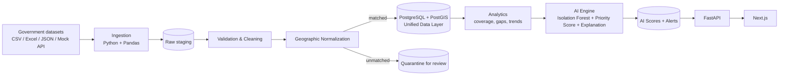
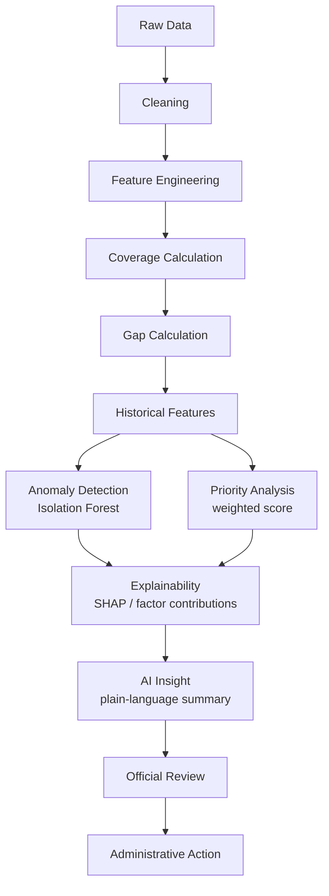
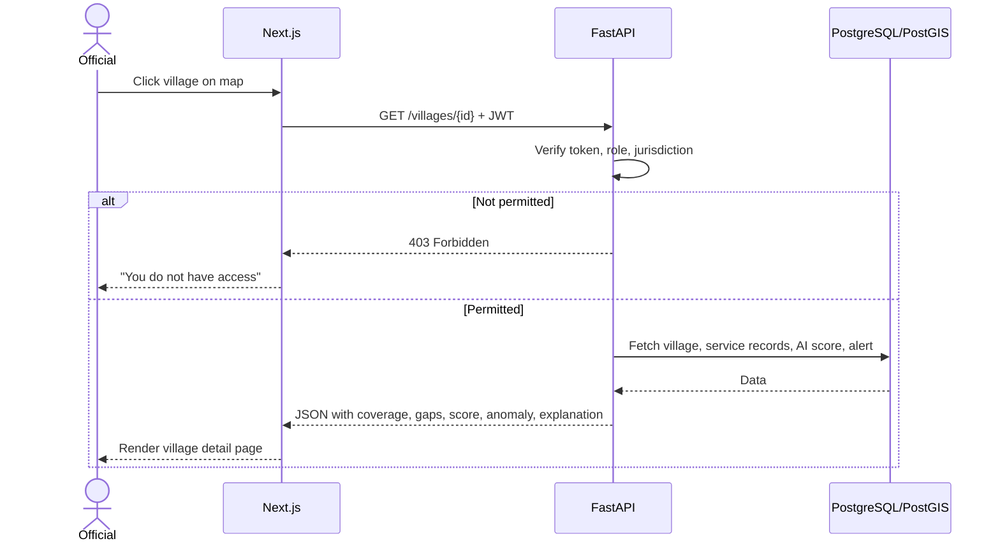
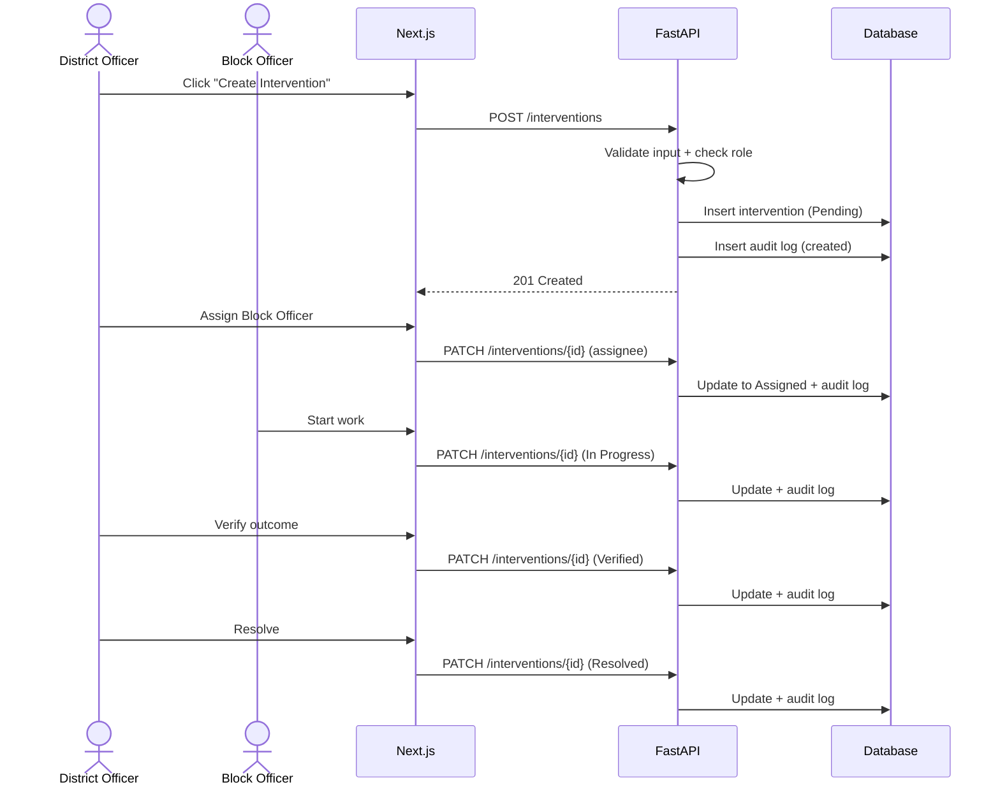
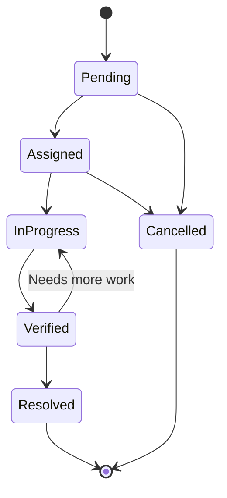
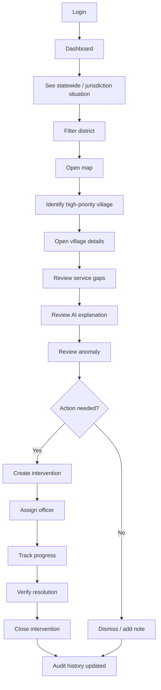
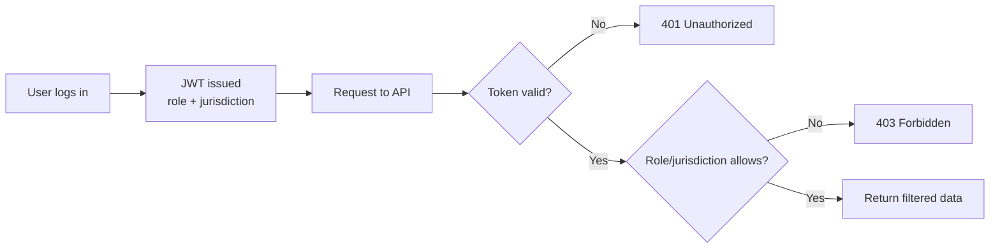
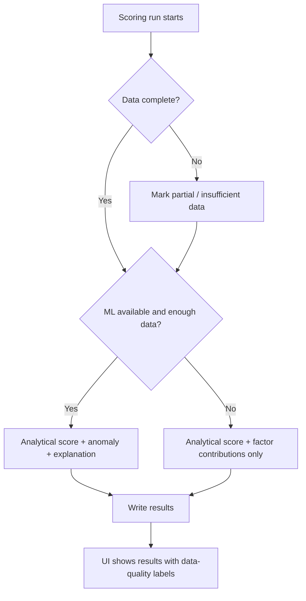
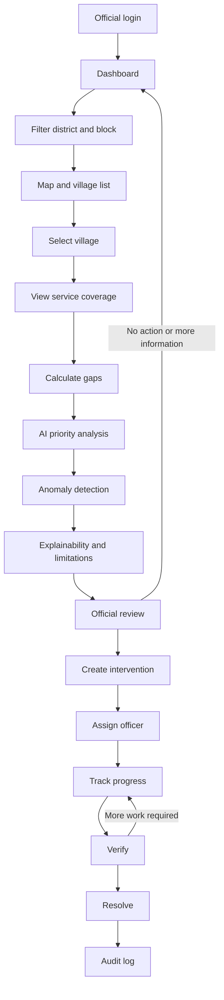
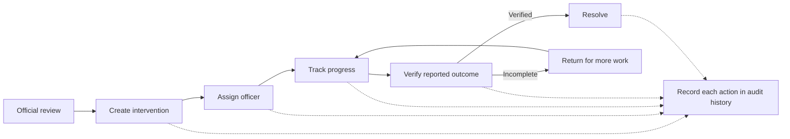

# SevaAI Manipur: System Workflow

Companion to [`architecture.md`](./architecture.md). This document focuses on **how things move**: data, AI, users, and interventions. All examples use **synthetic data**.

---

## 1. End-to-End Data Pipeline



**Key points**
- Raw data is always kept so cleaning can be re-run.
- Unmatched villages never silently disappear. They go to quarantine.
- AI outputs are **written back to the database**, so the UI reads pre-computed results.

---

## 2. AI Decision Pipeline



**Rule:** the pipeline ends with a **human**, never with an automatic decision.

---

## 3. Village X Walkthrough (Synthetic)

| Indicator | Value |
|---|---|
| Water coverage | Very low |
| Welfare coverage | Very low |
| Health coverage | Low |
| Housing coverage | Moderately low |
| Pending cases | High |
| Trend | Worsening |
| **Priority score** | **87 / 100 (High, Red)** |
| **Anomaly** | Unusual combination of multi-service gaps: review recommended |

**Explanation shown to the official**

```
Main contributing factors:
  ▲ Low water coverage
  ▲ High pending cases
  ▲ Low welfare coverage
  ▲ Negative historical trend
```

**Next step:** official reviews → creates intervention → assigns officer → tracks to resolution.

---

## 4. Request Sequence: Opening a Village Page



---

## 5. Sequence: Creating an Intervention



---

## 6. Intervention Status Lifecycle



| Status | Who typically moves it |
|---|---|
| Pending → Assigned | District Officer / State Admin |
| Assigned → In Progress | Assigned officer |
| In Progress → Verified | District Officer / State Admin |
| Verified → Resolved | District Officer / State Admin |
| Any → Cancelled | District Officer / State Admin (reason required) |

Every transition writes an **audit log entry**.

---

## 7. Official's Journey



---

## 8. Access Control Flow



| Role | Scope |
|---|---|
| State Admin | All Manipur |
| District Officer | Assigned district |
| Block Officer | Assigned block |

---

## 9. Failure Handling Flow



**Principle:** if ML fails, the transparent score still works. Missing data is never silently treated as zero.

---

## 10. Hackathon Build Order (Suggested)

| Phase | Goal | Owner(s) |
|---|---|---|
| 1 | Freeze DB schema and API response shapes | Data + Backend |
| 2 | Generate synthetic data and geography table | Data |
| 3 | Priority score and anomaly detection on a CSV | AI |
| 4 | Core API: login, villages, dashboard | Backend |
| 5 | Dashboard and village page using mock JSON | Frontend |
| 6 | Map with priority colours | Map/GIS |
| 7 | Intervention + audit endpoints and UI | Backend + Frontend |
| 8 | Connect everything end-to-end | Integration |
| 9 | Rehearse demo with backup recording | Everyone |

---

## 11. Demo Script Outline (for judges)

1. **Problem:** fragmented schemes, no combined view.
2. **Login** as District Officer.
3. **Dashboard:** priority areas and alerts.
4. **Map:** filter by district; spot a red village.
5. **Village page:** gaps, score, anomaly, explanation.
6. **Create intervention** and assign.
7. **Update status** to Verified/Resolved.
8. **Audit history.**
9. **Closing message:** *"AI informs. Officials decide. The system records."* All demo data is synthetic. Production would use authorized data channels.

## 12. Primary official workflow



The backend authenticates the official and limits every request to the user's authorized role and geography. The dashboard and map show the active reporting period and data-quality context. Village details show available service numerators and denominators; for valid measures, **Coverage = Covered / Eligible × 100** and **Gap = 100 - Coverage**. If the denominator is zero or missing, coverage is unavailable rather than zero.

Priority and anomaly outputs are review aids. An anomaly means an unusual pattern requiring investigation; it is not fraud detection or proof of wrongdoing. The official checks source quality and context, then records whether follow-up is appropriate. AI never automatically approves or rejects benefits.

## 13. Intervention lifecycle



The intervention records the reviewed issue, linked geography/service, responsible assignee, status, and relevant timestamps. Assignment, progress, verification, and resolution transitions are auditable. Verification must be performed by an authorized reviewer under the applicable operating policy; closing a task does not alter benefit eligibility or prove a model result was correct.
